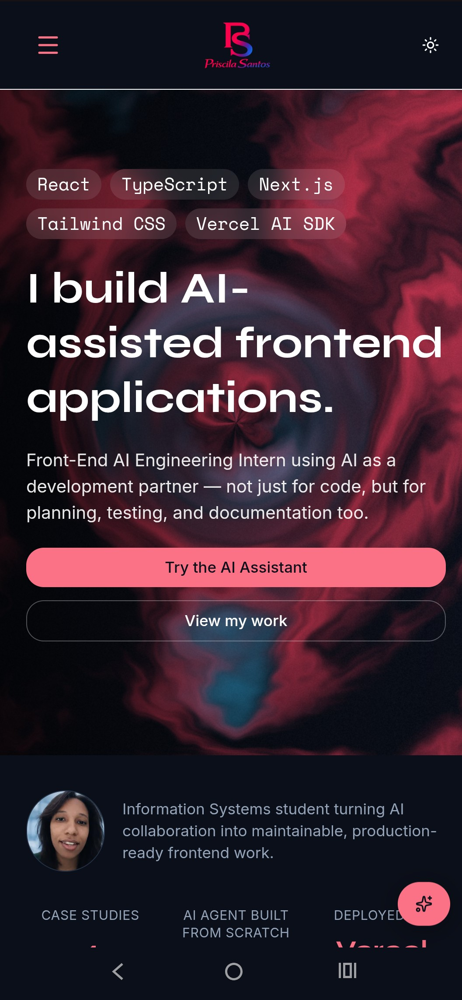
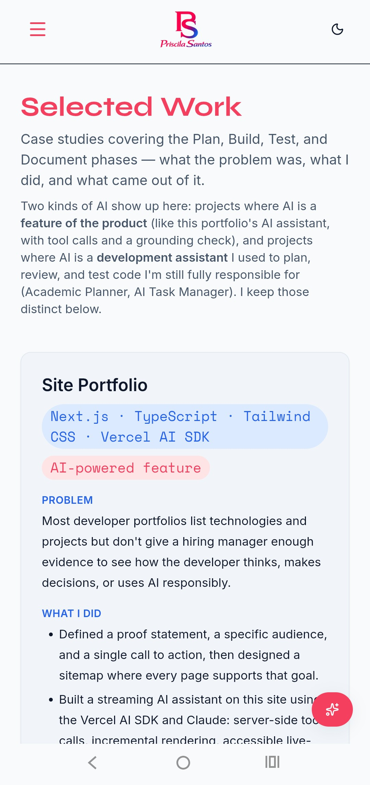
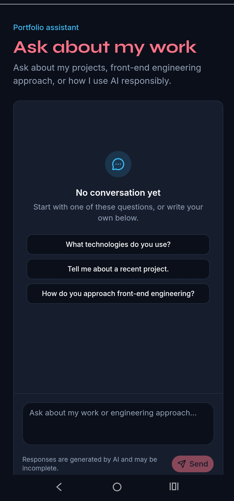

# Priscila Santos — Portfolio

A production Next.js 14 portfolio built to demonstrate AI-assisted front-end
engineering, not just describe it. The site itself ships a working example:
a streaming AI assistant with real tool calls, a grounding check, and
production hygiene (rate limiting, input caps, timeouts) — built as part of
the FlyRank AI Engineering Internship (Frontend AI Engineering track).

#### **Live URL:** https://priscila-portfolio.vercel.app/
#### **3D Lab:** https://priscila-portfolio.vercel.app/lab/3d
#### **Motion button demo:** https://priscila-portfolio.vercel.app/playground/motion-button

---

## What this project does

- A standard portfolio (Home, Work, About, Contact) presenting case
  studies with a Problem → What I Did → Outcome structure.
- `/ai` — a portfolio assistant that answers visitor questions about my
  background and projects. It is a real **agent**, not a prompt-stuffed
  chatbot: it calls `listProjects` / `readProject` to pull facts from
  `content/portfolio/*.md`, drafts an answer, then calls `checkGrounding`
  (a deterministic word-overlap check) before finalizing — capped at two
  grounding passes so it can't loop forever. See
  [`week-five/ASSIGNMENT_COACH.md`](https://github.com/Priscila-Santos/flyrank-ai-fluency/blob/main/week-five/ASSIGNMENT_COACH.md) and
  [`week-six/EXPLAIN_MY_CODE.md`](https://github.com/Priscila-Santos/flyrank-ai-fluency/blob/main/week-six/EXPLAIN_MY_CODE.md) for the
  full design and how it actually works under the hood.
- A `scoreLead` tool the same assistant can call to compute a deterministic
  lead score from a company name and employee count.
- `/lab/3d` — a lazy-loaded, fallback-first WebGL model viewer
  (React Three Fiber) with a live material configurator.
- `/playground` — hand-built accessible components (Modal, Tabs,
  Disclosure) compared against their shadcn/ui equivalents, as evidence I
  understand what a headless UI library is actually doing.

## Screenshots

| Home | Work | AI Assistant |
|---|---|---|
| <p align="center"></p> | <p align="center"></p> | <p align="center"></p> |


---

## Architecture overview

```text
Browser
  app/ai/page.tsx
    -> features/chat/components/chat-interface.tsx   (client, useChat)
      -> POST /api/portfolio-agent
        -> app/api/portfolio-agent/route.ts           (rate limit -> input caps -> streamText)
          -> lib/ai/portfolio-agent.ts + portfolio-agent-tools.ts
            -> lib/ai/portfolio-sources.ts             (reads content/portfolio/*.md)
            -> Google Gemini (via @ai-sdk/google)
```

The design intentionally keeps each layer to one responsibility:

- **Page** (`app/ai/page.tsx`) — Server Component, no secrets, no client state.
- **Client chat component** — owns input, scroll, and streaming UI state.
- **API route** — the server boundary. Rate-limits and caps input *before*
  spending any model tokens, converts UI messages to model messages, and
  starts the streamed response.
- **Agent module** — the system prompt and the tool-driven decision loop
  (identify source → read source → draft → check grounding → revise once
  if needed → finalize).
- **Model provider** — Google Gemini, called only from the server.

Full request/streaming lifecycle, hook-by-hook explanation, and the
accessibility decisions behind the chat UI are documented in
[`docs/streaming-chat.md`](./docs/streaming-chat.md).

## Tech stack

React 18 · Next.js 14 (App Router) · TypeScript · Tailwind CSS · Vercel AI
SDK (`ai`, `@ai-sdk/react`, `@ai-sdk/google`) · Zod · React Three Fiber /
drei / leva · Vitest + Testing Library · Playwright.

---

## Environment variables

| Variable | Required | Where it's used | Notes |
|---|---|---|---|
| `GOOGLE_GENERATIVE_AI_API_KEY` | Yes | `lib/ai/portfolio-chat.ts` (server only, via `app/api/portfolio-agent/route.ts`) | Google AI Studio free-tier key. Never prefix with `NEXT_PUBLIC_` — that would expose it to the browser. |

That is the only environment variable this project needs. `.env.example`
documents it; copy it to `.env.local` and fill in the real value for local
development. In Vercel, set it under **Project Settings → Environment
Variables** for Production and Preview (add Development only if you use
Vercel's cloud dev environment).

---

## Local development

```bash
git clone https://github.com/Priscila-Santos/priscila-portfolio.git
cd <priscila-portfolio>
npm install
cp .env.example .env.local   # then paste your GOOGLE_GENERATIVE_AI_API_KEY
npm run dev
```

Open http://localhost:3000.

### Tests

```bash
npm run test        # Vitest + Testing Library (unit/component)
npm run test:e2e     # Playwright (end-to-end)
```

---

## Production deployment & hygiene (FE-11)

### Hosting

Deployed on Vercel, connected to the `main` branch. Preview deployments run
automatically on pull requests.

### Rate limiting & input caps

`app/api/portfolio-agent/route.ts` protects the AI route in two layers,
**before** any model call is made:

1. **Rate limiting** (`lib/rate-limit.ts`) — an in-memory, per-IP sliding
   window (8 requests / minute). Requests over the limit get an HTTP `429`
   with a `Retry-After` header instead of reaching the model.
2. **Input caps** — a conversation longer than 40 messages, or any single
   message longer than 4,000 characters, is rejected with an HTTP `413`
   before conversion or streaming starts.

**Honest limitation:** the rate limiter is in-memory, so it is per
serverless-function-instance, not global — it resets on cold start and
doesn't coordinate across regions or concurrent instances. For a
personal-portfolio traffic level this is enough to stop a casual abuse
script or a stuck retry loop; it is not a substitute for a shared store
(e.g. Upstash Redis) at real scale. That upgrade path is intentionally
documented instead of silently pretended away.

### Timeout

`export const maxDuration = 30;` in the route caps how long a single
request may run, independent of the agent's own 5-step cap
(`stopWhen: stepCountIs(5)`), so a slow tool call or slow model response
can't hang a visitor's browser indefinitely.

### Cross-browser pass

Manually verified on:

- [ ] Chrome (desktop)
- [ ] Firefox (desktop)
- [ ] Safari (desktop, macOS)
- [ ] Safari (mobile, iOS)


### Custom domain

Not yet configured. FlyRank's planned subdomain
(`priscilasantos.flyrank.ai`) and the DNS/CNAME steps to point it at this
Vercel deployment are documented in
[`week-five/DNS_Walkthrough.md`](https://github.com/Priscila-Santos/flyrank-ai-fluency/blob/main/week-five/DNS_Walkthrough.md); the
checklist there is the source of truth for finishing this step.

---

## Project structure

```text
app/
  ai/page.tsx                       # /ai route + metadata
  api/portfolio-agent/route.ts      # server POST endpoint (rate limit, caps, streaming)
  work/page.tsx
  about/page.tsx
  contact/page.tsx
  lab/3d/                           # lazy-loaded 3D viewer route
  playground/                       # hand-built accessible components + motion button demo

features/
  chat/components/                  # chat UI (interface, message, tool-invocation)
  three/                            # 3D viewer components + hooks

lib/
  ai/
    portfolio-chat.ts               # Gemini model selection
    portfolio-agent.ts              # system prompt + decision loop
    portfolio-agent-tools.ts        # listProjects / readProject / checkGrounding / scoreLead
    portfolio-sources.ts            # reads content/portfolio/*.md
  rate-limit.ts                     # in-memory per-IP limiter (this checkpoint)
  utils.ts

content/portfolio/*.md              # grounding source for the AI assistant

components/ui/                      # shared, reusable primitives (Button, Dialog, Tabs, etc.)
```

---

## Key engineering decisions

- **Next.js over a plain Vite SPA or a full-stack app with a database** —
  weighed in [`week-four/THREE_ROADS.md`](https://github.com/Priscila-Santos/flyrank-ai-fluency/blob/main/week-four/THREE_ROADS.md).
  Next.js gives routing, SEO, and image optimization without needing a
  backend the portfolio doesn't otherwise require.
- **Portfolio assistant built as an agent, not a workflow** — the
  distinction, and why it matters, is worked through in
  [`week-four/AGENT_AND_MCP.md`](https://github.com/Priscila-Santos/flyrank-ai-fluency/blob/main/week-four/AGENT_AND_MCP.md) and
  [`week-five/ASSIGNMENT_COACH.md`](https://github.com/Priscila-Santos/flyrank-ai-fluency/blob/main/week-five/ASSIGNMENT_COACH.md). The
  assistant decides which source to read and whether a draft needs
  revision — it isn't a fixed script.
- **Local markdown files instead of an external fetch tool for grounding**
  — keeps answers deterministic and verifiable for a demo, at the cost of
  the assistant only knowing what's in `content/portfolio/`. Documented as
  a deliberate scope cut in `week-five/BUILD_LOG.md`.
- **In-memory rate limiting instead of a hosted store** — a conscious
  trade-off for this project's traffic level and env-var footprint; see
  [Production deployment & hygiene](#production-deployment--hygiene-fe-11)
  above.

## How AI tools built this (honest account)

AI was used throughout — planning, implementation, review, and
documentation — but with a consistent split: **AI proposes, I decide.**
Specifics, not platitudes:

- **Planning before code.** Every feature (the AI agent, the motion button,
  the 3D viewer) started with an AI-assisted design pass — architecture,
  tool contracts, evaluation cases — written *before* implementation, so
  there was something concrete to validate against once code existed. See
  `week-five/ASSIGNMENT_COACH.md` §6 ("Evaluation Cases (Pre-Build)") for a
  case where I wrote pass/fail criteria before the agent was built.
- **AI-generated code was reviewed, not trusted by default.** Example: the
  `checkGrounding` heuristic initially over-flagged legitimate synthesis as
  unsupported; I tuned the overlap threshold myself after testing it
  against deliberately-fabricated claims (`week-five/BUILD_LOG.md`,
  Session 3). Example: `app/playground/NOTES.md` documents building
  `Modal`, `Tabs`, and `Disclosure` by hand *first*, and using an AI tool
  only afterward as a reviewer against the ARIA Authoring Practices
  pattern — not as the author of those components.
- **AI made mistakes that I caught and fixed, not AI hallucinations I
  shipped.** The `checkGrounding` heading false-positive
  (`week-five/BUILD_LOG.md`, Session 5) is documented as a known,
  reproduced limitation rather than silently patched over or hidden.
- **AI accelerated debugging, not just authored features.** The
  `week-seven/AUDIT.md` Lighthouse investigation used AI to help trace a
  6,500ms TBT regression on `/lab/3d` to a 1.5MB HDR environment texture
  loading eagerly — but the fix (auto-enable heuristic scoping) and the two
  markup bugs it exposed (missing `foreground` color key, skipped heading
  level) were verified against the actual Tailwind config and DOM, not
  taken on faith.
- **Where I explicitly did not use AI**, and why that mattered: see
  "Where I chose not to use AI" in `app/playground/NOTES.md`.

Full prompt-engineering history — including a baseline-to-final prompt
ladder and a Claude-vs-ChatGPT comparison on the same task — is in
[`week-two/PROMPT_LADDER.md`](https://github.com/Priscila-Santos/flyrank-ai-fluency/blob/main/week-two/PROMPT_LADDER.md) and
[`week-two/PROMPTING_FUNDAMENTALS.md`](https://github.com/Priscila-Santos/flyrank-ai-fluency/blob/main/week-two/PROMPTING_FUNDAMENTALS.md).

---

## Known limitations / still ugly list

Carried over honestly from `week-five/FEEDBACK.md` and this checkpoint,
rather than hidden:

- No real screenshots yet (desktop or mobile) for any page.
- Dark mode and the full Identity Kit typography/color system
  (`week-three/IDENTITY_KIT.md`) are documented but not wired into
  `app/globals.css`.
- Rate limiting is in-memory / per-instance, not a shared store — see
  above.
- Cross-browser pass checkboxes above are unchecked until actually run.
- Custom domain not yet configured.
- `npm audit` flags high-severity CVEs rooted in the pinned Next.js
  14.2.35; upgrading to Next 16 is a breaking change deferred post-launch
  as documented in `week-five/BUILD_LOG.md`.

---

## AI Lead-Scoring Tool

The portfolio assistant includes a server-side tool, `scoreLead`, that
computes a deterministic lead score from a company name and employee
count instead of letting the model free-form a number.

**Input:** `{ company: string; employees: number }`
**Output:** `{ company, score, priority: "Low" | "Medium" | "High", recommendation }`

Try it: *"Score Acme with 500 employees."* Sending `company = "error"`
forces the tool to throw, so the error UI state can be verified on demand.

## Buttons with a Brain (FE-AA1)

`components/ui/async-action-button.tsx` — one component, two presets
(`SendButton`, `DeployButton`), narrating idle → hover → loading →
success/error → idle through motion rather than an abrupt swap. Full
duration/easing notes and live triggers:
[`/playground/motion-button`](https://priscila-portfolio.vercel.app/playground/motion-button).

## 3D Model Viewer (FE-AA2)

Drag-and-drop `.glb` loading, a live material configurator (leva), and a
fallback-first loading strategy so the ~600KB Three.js/fiber/drei/leva
bundle never loads outside `/lab/3d`. Full write-up with real bundle-size
and frame-rate numbers:
[`week-seven/THREE_D_EXPERIENCE.md`](https://github.com/Priscila-Santos/flyrank-ai-fluency/blob/main/week-seven/THREE_D_EXPERIENCE.md).

---

## License

MIT.